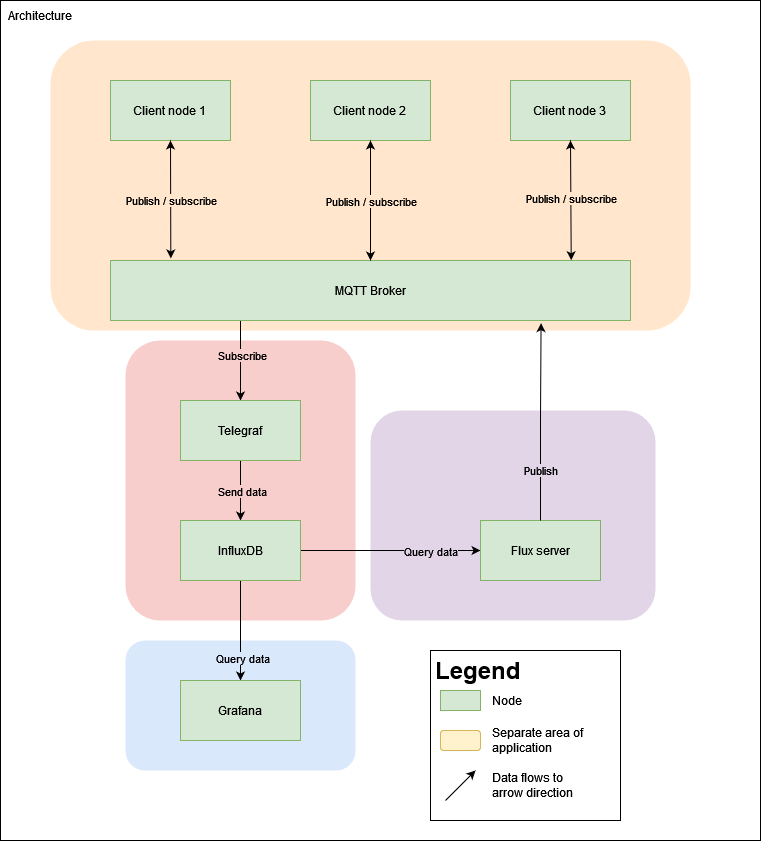

# distributed-systems

## General information

### Group members

- Markus Kaihola
- Elias Herranen
- Leevi Leinonen
- Oskari Nuottonen

### Group work style

 - Evenings and weekends

## Project definition

Industrial machinery monitoring system utilizing edge computation

### Architecture

The architecture of the application will be an event based pub/sub system utilizing the MQTT protocol.



The application consists of multiple areas of which not all need to be implemented at once to achieve a working product.

The core of the application consists of edges nodes running in industrial factories. These client nodes will communicate with a broker using the MQTT protocol. The MQTT broker simplifies the node discovery since the clients only need to know about the broker. The broker also quarantees consistency since it queues the messages that for some reason cannot be sent at the moment and will send them later.

The data storage part of the application consists of Telegraf and InfluxDB nodes. Telegraf will subscribe to the MQTT broker, parse the data and send it to the InfluxDB node.

Another part of the application is data handling section that queries the InfluxDB node with Flux queries. It can then publish data to MQTT broker and the client nodes can access the data.

An user facing application can be implemented with Grafana that queries data from the InfluxDB node. The Grafana node can define thresholds to alert the administrators of the system under certain conditions, like system failure.

### Communication mechanism

The main communication mechanisms are MQTT protocol in the core application nodes that connect to the MQTT broker and HTTPS protocol for the more user facing applications.

## Setting up

To set up Telegraf, InfluxDB and Grafana for development, (at the moment) you need to do some manual work. This will only need to be done once, unless you delete the docker volume data.

First run

```bash
docker compose up influxdb
```

Then go to [http://localhost:8086](http://localhost:8086) to complete the InfluxDB setup. During the setup, an admin token is created. Copy the value of that to yourself. You will also have to define the organization name, that can be anything. Also create a new bucket (not the default bucket created on startup) and name something like `temperatures`.

Next you can kill the running docker compose.

Next run

```bash
export INFLUXDB_TOKEN=<value-of-your-token>
```

Telegraf configuration will then read the token from the environment. Now you can start all of the services

```bash
docker compose up -d
```

Now go to [http://localhost:3000](http://localhost:3000) and setup the Grafana instance (default login is admin:admin). Then go to set up a data source with the following values

#### Query language

Flux

### HTTP

- URL = http://influxdb:8086

### Auth

- Select Basic auth
  - User: Your influxdb username
  - Password: Your influxdb password

### InfluxDB Details

- Organization = Your influxdb organization name
- Token = Your influxdb admin token
- Default bucket = The bucket you created to influxdb

Then click Save and test. If all goes well, the connection should be up.

Next you can go to the Explore tab to query the InfluxDB. An example query to select the temperature mean data:

```flux
from(bucket: "temps")
  |> range(start: -1h)
  |> filter(fn: (r) => r._field == "temperature")
  |> aggregateWindow(every: 5m, fn: mean)
```